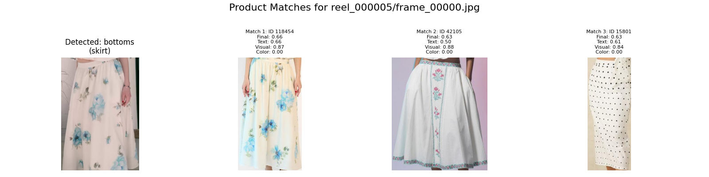
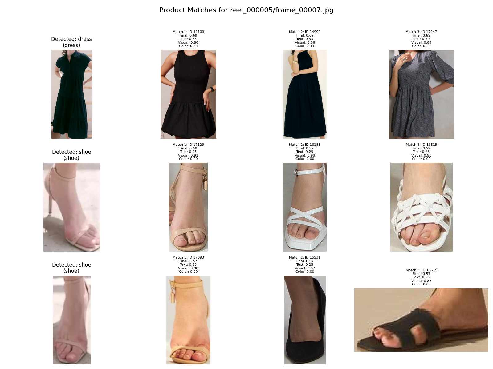

# Flickd AI Hackathon - Product Matching and Vibe Classification

This project implements a pipeline to extract frames from videos, detect objects within those frames, match detected objects and full frames to a product catalog, classify video vibes, and consolidate all this information into a structured JSON output.

## Project Structure

The key scripts and their functions are:

*   `preprocess_catalog.py`: Processes the product catalog, generates CLIP embeddings for catalog items and full images, and creates FAISS indexes for efficient similarity search. It also handles YOLOv8 detection on catalog images to create item crops.
*   `extract_frames.py`: Extracts individual frames from input videos.
*   `detect_objects.py`: Runs YOLOv8 object detection on video frames to identify various fashion items.
*   `match_products.py`: Uses CLIP embeddings to find the most visually and textually similar products from the catalog for detected objects and full frames. It also incorporates color similarity and re-ranks matches.
*   `classify_vibes.py`: Classifies the overall vibe of a video using a zero-shot text classification model, enhanced with visual features from CLIP embeddings of video frames and object detections, and additional textual metadata.
*   `create_final_output.py`: Consolidates the outputs from vibe classification and product matching into a single, structured JSON file per video, providing overall vibes and top product matches per frame.
*   `utils.py`: Contains utility functions used across various scripts (e.g., bounding box manipulation, image cropping).
*   `visualize_detections.py`: A utility to visualize the detected objects on video frames.
*   `visualize_match.py`: A utility to visualize the product matches overlaid on video frames and display catalog matches.

## Setup

1.  **Clone the repository:**
    ```bash
    git clone https://github.com/eclipse1605/flickd-advay.git
    cd flickd-advay
    ```

2.  **Create and activate a Python virtual environment (recommended):**
    ```bash
    python3 -m venv .venv
    source .venv/bin/activate
    ```

3.  **Install dependencies:**
    Ensure you have `pip` installed. Then, install the required packages:
    ```bash
    pip install -r requirements.txt
    ```

4.  **Download Models:**
    The `preprocess_catalog.py` script will automatically download `clip-ViT-L-14` (SentenceTransformer) and `fashionpedia-yolov8n.pt` (YOLOv8) models into the `models/` directory upon its first run.

## Running the Pipeline

The pipeline is designed to be run sequentially. For optimal results, ensure you have placed your video files in the `data/videos/` directory and your catalog CSV and images in `data/catalog/` and `data/catalog/images/` respectively.

You can run the pipeline for a specific video ID (e.g., `reel_000005`) or for all videos in the `data/videos/` directory by passing `--video-id all`.

**Example for a specific video (e.g., `reel_000005`):**

1.  **Preprocess the Catalog:**
    This step processes your `catalog.csv`, generates image embeddings, and creates FAISS indexes and metadata files required for product matching. This **must be run first** and whenever your catalog or model configurations in `preprocess_catalog.py` change.
    ```bash
    python3 preprocess_catalog.py
    ```

2.  **Extract Frames:**
    Extracts individual JPEG frames from the specified video into `frames/<video_id>/`.
    ```bash
    python3 extract_frames.py --video-id reel_000005
    ```
    (Or `--video-id all` to process all videos)

3.  **Detect Objects:**
    Performs object detection on the extracted frames and saves detection bounding boxes and class labels to `data/detections/<video_id>_detections.json`.
    ```bash
    python3 detect_objects.py --video-id reel_000005
    ```
    (Or `--video-id all` to process all videos)

4.  **Match Products:**
    Matches detected objects and full frames to the product catalog using CLIP embeddings and other scoring mechanisms. Outputs results to `outputs/product_matches/<video_id>_product_matches.json`.
    ```bash
    python3 match_products.py --video-id reel_000005
    ```
    (Or `--video-id all` to process all videos)

5.  **Classify Vibes:**
    Classifies the overall vibe of the video and saves the results to `outputs/vibe_classifications/<video_id>_vibes.json`.
    ```bash
    python3 classify_vibes.py --video-id reel_000005
    ```
    (Or `--video-id all` to process all videos)

6.  **Create Final Output:**
    Consolidates the vibe classifications and product matches into a single, comprehensive JSON file in `submission/<video_id>_output.json`. This is the final output of the pipeline.
    ```bash
    python3 create_final_output.py --video-id reel_000005
    ```
    (Or `--video-id all` to process all videos)

## Output Format

The final output for each video is a JSON file located in `submission/` with the following structure:

```json
{
    "video_id": "reel_000001",
    "overall_vibes": [
        "Sporty",
        "Casual",
        "Urban"
    ],
    "frames_data": [
        {
            "frame_path": "frames/reel_000001/frame_00000.jpg",
            "frame_number": 0,
            "top_matches": [
                {
                    "type": "top",
                    "color": "blue",
                    "match_type": "exact_match",
                    "matched_product_id": "product_123",
                    "confidence": 0.85,
                    "catalog_crop_bbox": [0.1, 0.2, 0.3, 0.4]
                },
                {
                    "type": "bottom",
                    "color": "black",
                    "match_type": "similar_match",
                    "matched_product_id": "product_456",
                    "confidence": 0.78,
                    "catalog_crop_bbox": [0.5, 0.6, 0.7, 0.8]
                },
                {
                    "type": "footwear",
                    "color": "white",
                    "match_type": "no_match",
                    "matched_product_id": "product_789",
                    "confidence": 0.45,
                    "catalog_crop_bbox": [0.05, 0.1, 0.15, 0.2]
                },
                {
                    "type": "full_frame",
                    "color": "N/A",
                    "match_type": "similar_match",
                    "matched_product_id": "outfit_001",
                    "confidence": 0.60,
                    "catalog_crop_bbox": [0.0, 0.0, 1.0, 1.0]
                }
            ]
        },
        {
            "frame_path": "frames/reel_000001/frame_00001.jpg",
            "frame_number": 1,
            "top_matches": [
                {
                    "type": "dress",
                    "color": "red",
                    "match_type": "exact_match",
                    "matched_product_id": "product_101",
                    "confidence": 0.92,
                    "catalog_crop_bbox": [0.2, 0.3, 0.6, 0.9]
                },
                {
                    "type": "accessory",
                    "color": "gold",
                    "match_type": "similar_match",
                    "matched_product_id": "product_202",
                    "confidence": 0.70,
                    "catalog_crop_bbox": [0.7, 0.1, 0.8, 0.2]
                },
                {
                    "type": "full_frame",
                    "color": "N/A",
                    "match_type": "no_match",
                    "matched_product_id": "outfit_002",
                    "confidence": 0.55,
                    "catalog_crop_bbox": [0.0, 0.0, 1.0, 1.0]
                }
            ]
        }
    ]
}
```

## Visualization

You can visualize the product matches using `visualize_match.py`.

```bash
python3 visualize_match.py <reel_number> <frame_number> [--top_n N] [--output_dir <directory>]
```
Example:
```bash
python3 visualize_match.py 5 0 --top_n 4 --output_dir outputs/visualized_matches
```

### Examples:

**Frame 0 of Reel 000005:**


**Frame 7 of Reel 000005:**


## Models Used

*   **CLIP (`clip-ViT-L-14`)**: Used for generating image embeddings for visual similarity matching.
*   **YOLOv8 (`fashionpedia-yolov8n.pt`)**: Used for object detection on video frames and catalog images.
*   **Sentence Transformers (`all-MiniLM-L6-v2`)**: Used for text similarity re-ranking of product matches.
*   **BART (`facebook/bart-large-mnli`)**: Used for zero-shot text classification in vibe classification.
